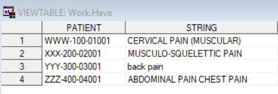
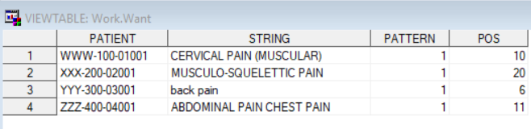
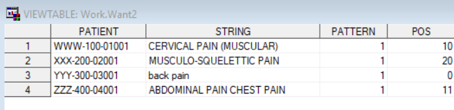
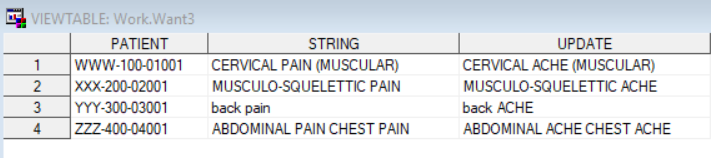
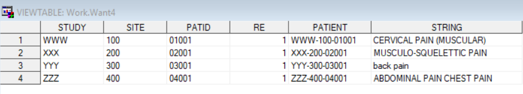
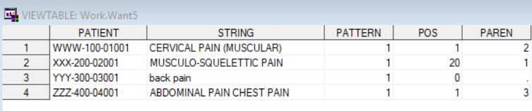
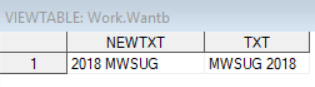
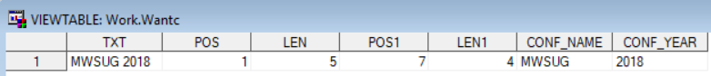
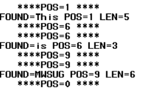
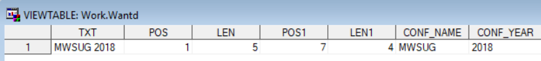

## References.

- [The Basics of the PRX Functions.](https://support.sas.com/resources/papers/proceedings/proceedings/forum2007/223-2007.pdf)

- [Perl Regular Expression – The Power to Know the PERL in Your Data.](http://www.mwsug.org/proceedings/2018/SB/MWSUG-2018-SB-145.pdf)

- [Quick Tips and Tricks: Perl Regular Expressions in SAS.](https://www.sas.com/content/dam/SAS/support/en/sas-global-forum-proceedings/2019/4005-2019.pdf)


## Introduction.   

<u>`Perl Regular Expression(PRX)`</u>.    

We are constantly needing ways to search for <span style="color: blue;">patterns in text</span>, and <span style="color: blue;">change particular pieces of text</span>.    

PRX is one of the powerful and efficient techniques for complex string data
manipulation.

The `PRX functions` and `call routines` let you to use the pattern matching features of Perl 5.6.1 to do these tasks, and more.


##


## `Wildcards`   

Perl also uses wildcards, special characters (called metacharacters in Perl) which stand for more than one single text character. A few of the common ones are:   

<PRE>
- . the period matches exactly one character, regardless of what that 
  character is.    
- \w a ‘word’-like character, \w matches any of the characters a-z, 
   A-Z, 0-9, or the underscore    
- \d a ‘digit’ character, \d matches the numbers 0 to 9 only   
- \s a ‘space’-like character, \s matches any whitespace character, 
   including the space and the tab   
- \t matches a tab character only   
- \W a ‘non-word’ character, that is, anything not matched by \w   
- \D a ‘non-digit’ character, that is, anything not matches by \d   
- \S a ‘non-whitespace’ character, that is, anything not matched by \s   
</PRE>


## Example ...

`"/a.x/"`


This would `match` any string which contained an ‘a’, followed by any character, followed by an ‘x’. 

  - ‘arx’ in ‘Marx’,
  - ‘anx’ in ‘Manx’ or ‘phalanx’, and 
  - ‘aux’ in ‘auxiliary’. 
  
It would `not match`:   

  - ‘Matrix’,as the period will only match one character, and there are three characters between the ‘a’ and ‘x’ in Matrix.


## Example ...

`"/M\w\wx/"`  


This would `match` any string which contained ‘M’, two ‘word’ characters, and an ‘x’. It would match:

   - ‘Marx’,
   - ‘M96x’ and, 
   - ‘M_1x’, since \w matches numbers and underscores as well.
   
   
Be sure that your use of wildcards doesn’t lead to too many false positives!


## `Iterators`

Perl also provides ‘iterators’, ways of indicating that you want to control the number of times a character or wildcard matches. 

Some of the iterators are:

<PRE>
- * matches 0 or more occurrences of the preceding pattern
- + matches 1 or more occurrences of the preceding pattern
- ? matches exactly 0 or 1 occurrences of the preceding pattern
- {k} matches exactly k occurrences of the preceding pattern
- {n,m} matches at least n and at most m occurrences of the 
      preceding pattern
</PRE>


## Examples ... 

`"/r+x/"`

Matches one or more occurrences of ‘r’, followed immediately by an ‘x’. 

  - ‘rx’ and ‘rrrx’ and
  - ‘rrrrrrrrrrx’. 
  - ‘rx’ in ‘Marx’, 

But not the ‘rix’ in ‘Matrix’.


## Examples ... 

`"/ri?x/"`  


This would match ‘r’, followed by an optional ‘i’, and then followed by ‘x’.  

So this would match both the ‘rx’ in ‘Marx’ and the ‘rix’ in ‘Matrix’.


## Examples ... 

`"/k\w{0,7}/"`

This would match a ‘k’, followed by 0 up to 7 ‘word-like’ characters. 

Remember that the `\w` wildcard matches a ‘word’.


## Examples ... 

`"/Ma\w{1,3}x/"`

This would match a capital ‘M’, followed by ‘a’, followed by one to three ‘word’ characters, followed by ‘x’.

- ‘Matrix’ and ‘Marx’. 
- ‘Manx’ and ‘Maalox’ and ‘M1_9x’


## Grouping Expression

Parentheses are the usual choice for grouping, and the ‘or’ operator | provides alternation. 

Perl also uses the parentheses to ‘capture’ chunks of the pattern for later use


`"/r|n/"`

The ‘|’ operator tells us to choose either ‘r’ or ‘n’. So any string which has either an ‘r’ or an ‘n’ will match.


## Grouping example . .. 

`"/Ma(r|n)x/"`  


The parentheses group the two parts of the ‘alternation’ pattern. 

The whole pattern now will only match a capital ‘M’, then an ‘a’, then either ‘r’ or ‘n’, then ‘x’.

- only strings containing ‘Marx’ or ‘Manx’ will match.   

- strings like ‘Marxist’ or ‘MinxManxMunx’ will match this pattern.   


## Grouping example . .. 

`"/Ma(tri|r|n)x/"`


Parentheses group the patterns to be alternated. 

We do not have to have the same length patterns for alternation, and we do not have to stick with only two choices. 

- ‘Matrix’ or ‘Marx’ or ‘Manx’ would all match, as would any string containing one of them.


## More Metacharacters

<PRE>
- ^ represents the beginning of the string, before the first character
- $ represents the end of the string, after the last character
- \b represents a word boundary, the position between a ‘word’ character
     and a ‘non-word’ character
- \B matches when we are NOT at a word boundary
</PRE>


## Example.

`"/^M\w+x$/"`


The ‘^’ and ‘$’ indicate that the pattern must match at the beginning of the string and finish up at the end of the string.  


The `\w+` will match any sequence of ‘word’ characters’. So this would match; 

  - ‘Marx’ and ‘Matrix’ and ‘MinxManxMunx’.
  - ‘M3__9x’, since digits and underscores are also matched by `\w`.
 
 
 But it would not match;
 
  - ‘minManx’ (does not start with a ‘M’).
  - ‘Marxist’ (does not end with an ‘x’). 
 


## Example ...

`"/^M\w{2,6}x\b/"` 

Matches a string which begins with ‘M’, has 2 to 6 additional ‘word’ characters, followed by an ‘x’, and
then the word must end. 

It could be followed by a space, or a tab, or a percent sign, or a dash. 

But it cannot be followed one of the characters which are represented by the `\w` metacharacter.

`‘\b’` will only match at the boundary of a ‘word’, either immediately before or immediately after a string of characters that would be matched by `\w`.


## Example ...

`"/^M\w+x\B/"`  

This matches a string which begins with ‘M’, has one or more ‘word’ characters, then an ‘x’, and then something other than a ‘non-word’ character. 

The word cannot end at the ‘x’ and still match, because of the `\B` metacharacter.

  - This would match ‘Marxist’ or ‘MinxManxMunx’, because both of these strings could match starting with the capital ‘M’ and then match an ‘x’ in the middle of the ‘word’. 
  
  - This would not match ‘Matrix’ or ‘Marx’, because there is no way to get a match without having the ‘x’ as the last letter of the word, and `\B` disallows that.  


## Handling Special Characters in Searches.

How can we search for a phone number which has an area code in parentheses, if the open parenthesis mark and the close parenthesis mark are special? 

Perl lets us use the backslash `‘\’` to mark these metacharacters as regular characters. 

In Perl this is often called <span style="color: blue;">‘Quoting’</span> the special character.


## Example ... 

`"/(\d\d\d) \d\d\d-\d{4}/"`

This matches 3 digits, a space, 3 more digits, a dash, and 4 more digits.

But no real parentheses can be in the matched string. 

The parentheses are still metacharacters here. They mark the first 3 numbers as a group to be ‘captured’ for later processing.


## Example ... 

`"/\(\d\d\d\) \d\d\d-\d{4}/"` 

Now the opening and closing parentheses are to be treated as real parentheses, not special regular expression features. 

This matches 3 digits enclosed in parentheses, a space, 3 more digits, a dash, and 4 more digits.


## PRX Functions.

`PRXPARSE`  

Syntax: `prxparse(Perl-regular-expression)`   

Perl-regular-expression: The pattern to be parsed

`PRXPARSE` uses metacharacters to construct the regular Perl expression. 

It compiles a Perl regular expression that can be used by other Perl regular expression functions/call routines for pattern matching of a character value.


## SAS Example.
```{r,eval=FALSE}
data have;
  input patient $1-14 string $50.;
  datalines;
WWW-100-01001 CERVICAL PAIN (MUSCULAR)
XXX-200-02001 MUSCULO-SQUELETTIC PAIN
YYY-300-03001 back pain
ZZZ-400-04001 ABDOMINAL PAIN CHEST PAIN
;
run;
```

## SAS Data.

<center>
<hr>
<br>



</center>


## SAS Example.


```{r,eval=FALSE}
data want;
  set have;
  retain pattern;
  if _n_ = 1 then pattern = prxparse("/pain/i"); 
  pos = prxmatch(pattern,string);
run;

# Modifier ‘i’ makes the pattern matching case-insensitive.

```

## SAS Output.

<center>
<hr>
<br>


</center>

## PRXMATCH

Syntax: `prxmatch(pattern-id or regular-expression, string)`

Pattern-id: Returned value from PRXPARSE function, regular-expression: Perl regular expression,

string: Character value.

PRXMATCH function is used to search a pattern match and returns the position at which the pattern is
found. 

If there is no match found, PRXMATCH returns a 0 but if there are multiple matches found, only
the position of the first match is returned.


## SAS Example.

```{r,eval=FALSE}
data want2;
  set have;
  if _n_ = 1 then pattern = prxparse("/PAIN/");
  retain pattern;

  pos = prxmatch (pattern, string);
run;
```

## SAS Output.

<center>
<hr>
<br>


</center>


## PRXCHANGE

Syntax: `prxchange(Perl-regular-expression |regular-expression-id, times, source)`


Perl-regular-expression: The pattern to be parsed, regular-expression-id: Returned value from
PRXPARSE function, 

times: The number of times to perform the match and substitution

Source: The character string where the pattern is to be searched

The PRXCHANGE function performs a replacement for a matched pattern. 

The ‘s’ before the first delimiter indicates substitution in the code. The first argument of the function has 2 components-find and replace.


## SAS Example. 

```{r,eval=FALSE}
data want3;
  set have;
  update = prxchange("s/ pain/ ACHE/I", -1, string);
run;
```

## SAS Output.

<center>
<hr>
<br>


</center>


## PRXPOSN.


Syntax: `prxposn(regular-expression-id, capture-buffer, source)`   

Regular-expression-id: Returned value from PRXPARSE function, 

capture-buffer: Number indicating which capture buffer is to be evaluated, 

source:The character string where the pattern is to be searched.


PRXPOSN function returns the matched information from identified capture. 

PRXMATCH, PRXSUBSTR, PRXNEXT or PRXCHANGE functions are used before PRXPOSN function to reference the capture buffer.

In addition, regular expression id is required for this function.


## SAS Example.

```{r,eval=FALSE}
data want4;
  length study site patid $10.;
  retain re;
  if _n_ = 1 then re = prxparse("/(\w+)-(\d{3})-(\d{5})/");
  set have;

  if prxmatch(re, patient) then do;
    study = prxposn(re, 1, patient);
    site  = prxposn(re, 2, patient);
    patid = prxposn(re, 3, patient);
  end;
run;

```

## SAS Output.
<hr>
<br>




## PRXPAREN.


Syntax: `prxparen(regular-expression-id)`

Regular-expression-id: Returned value from PRXPARSE function.

PRXPAREN function returns a value of the largest capture buffer that contains the data of the first match.

PRXMATCH, PRXSUBSTR, PRXNEXT or PRXCHANGE functions (routines) are used with PRXPAREN together. 

It requires the regular expression id rather than the regular expression.


## SAS Example.

```{r,eval=FALSE}
data want5;
  set have;
  pattern = prxparse ("/(PAIN)|(CERVICAL)|(ABDOMINAL)/");
  pos = prxmatch (pattern, string);
  if pos then paren=prxparen(pattern);
run;

```

## SAS Output.

<center>



</center>


## CALL ROUTINES.

<center>Some of the Perl Regular functions have their call routine counterpart.

The call routines are similar to the functions, but they yield more information.</center>


## CALL PRXCHANGE

`call prxchange(regular-expression-id, times, old-string, new-string, resultlength, truncation-value, number-of-changes)`  

Regular-expression-id: Unique numeric regular expression id, 

times: Number of times the matching patterns replaced, 

old-string: Source text string,

new-string: New variable created after matching pattern replaced, 

result-length: a numeric variable representing the number of characters that are copied into the
result, 

truncation-value: The Boolean value (1 or 0) whether replacement result is longer than new string.


## SAS Example.
```{r,eval=FALSE}
data have2;
  txt = 'MWSUG 2018';
run;

data wanta;
  length newtxt $ 14.;
  set have2;
  retain re;
  if _n_ = 1 then re = prxparse("s/\d+/2019/");
  call prxchange(re, -1, txt, newtxt);
run;

data wantb(drop=re);
  length newtxt $ 14.;
  set have2;
  retain re;
  if _n_ = 1 then re = prxparse("s/(\w+)\s(\d+)/$2 $1/");
  call prxchange(re, -1, txt, newtxt);
run;
```

## SAS Output.

<center>

<hr>
<br>


<hr>
<br>

</center>
 

## CALL PRXPOSN


`call prxposn(regular-expression-id, capture-buffer, start, length)`

Regular-expression-id: Unique numeric regular expression id, 

capture-buffer: A numeric variable for representing the number of capture buffer, 

start: A numeric variable for the position of the capture buffer,

length: A numeric variable for the length of the capture buffer.


CALL PRXPOSN creates the position and length of the capture buffer as variables thus enabling us to
extract the desired part of the string using regular SAS functions such as substr() or substrn() later.


## SAS Example.

```{r,eval=FALSE}
data wantc(drop=re);
  set have2;
  retain re;
  if _n_ = 1 then re = prxparse("/(\w+)\s(\d+)/");
  if prxmatch(re, txt) then do;
    call prxposn(re, 1, pos, len);
    call prxposn(re, 2, pos1, len1);
    Conf_name = substr(txt, pos, len);
    Conf_year = substr(txt, pos1, len1);
  end;
run;
```

## SAS Output.

<center>
<hr>
<br>


</center>


## CALL PRXNEXT

`call prxnext (regular-expression-id, start, stop, source, position, length)`

Regular-expression-id: Unique numeric regular expression id, 

start: A numeric variable for the start position to find the matching pattern,

stop: A numeric variable for the position of last character to find the matching pattern, 

source: The input text, 

position: A numeric variable where matching pattern is found,

length: A numeric variable for the length of string matched by pattern.


CALL PRXNEXT searches for the given pattern of a substring repeatedly yielding the position and
length of each matching pattern in the string.

## SAS Example.

```{r,eval=FALSE}
data have3;
  txt = 'This is MWSUG 2018';
run;

data _null_;
  set have3;
  retain re;
  if _n_ = 1 then re = prxparse("/\w+\s/");
  start = 1;
  stop = length(txt);
  call prxnext(re, start, stop, txt, pos, len);
  do while (pos > 0);
    put "   ****" pos =  "****";
    found = substr(txt, pos, len);
    put found = pos = len =;
    call prxnext(re, start, stop, txt, pos,len);
    put "   ****" pos =  "****";
  end;
run;

  
```

## SAS Output.

<center>
<hr>
<br>


</center>

## CALL PRXSUBSTR

`call prxsubstr(regular-expression-id, source, position, length)`  

Regular-expression-id: Unique numeric regular expression id, 

source: The input text,

position: A numeric variable where matching pattern is found, 

length: A numeric variable for the length of string matched by pattern.


CALL PRXSUBSTR finds the location and length of the matching pattern substring we are interested in
a given character string. 

2 numeric variables position, and length as in the syntax are created. Once we know those 2 parameters, substring can be extracted.


## SAS Example.


```{r,eval=FALSE}
data wantd(drop=re:);
  set have2;
  retain re re1;
  length Conf_: $ 50.;
  if _n_ = 1 then do;
    re  = prxparse("/\w+/");
    re1 = prxparse("/\d+/");
  end;
  call prxsubstr(re, txt, pos, len);
  call prxsubstr(re1, txt, pos1, len1);
  if pos ^= 0  then Conf_name = substr(txt, pos, len);
  if pos1 ^= 0 then Conf_year = substr(txt, pos1, len1);
run;

```


## SAS Output.

<br>

<hr>

<br>




##

<br>

<br>

<hr>

<br>
<strong>
<center>
<code>
<p style="font-size:80px; color:blue;">prxparse("/(Que)stions/")</p>

</code>
</center>
</strong>
<br>

<hr>


